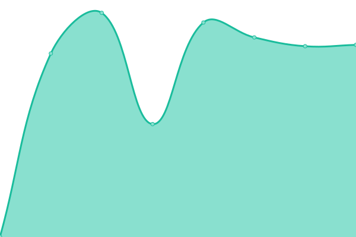
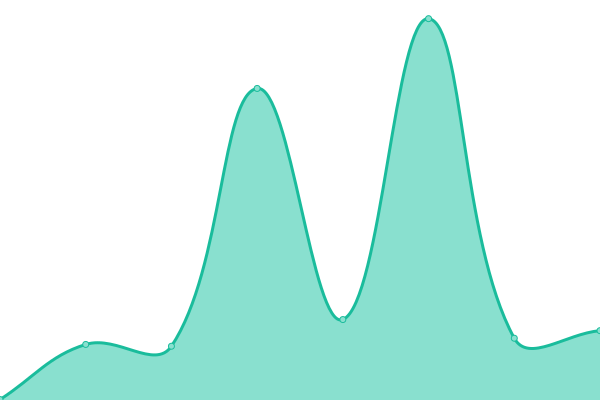

# [📈 Live Status](https://Monkee-Boy.github.io/site-monitor): <!--live status--> **🟩 All systems operational**

This repository contains the open-source uptime monitor and status page for [Monkee-Boy](https://www.monkee-boy.com), powered by [Upptime](https://github.com/upptime/upptime).

With [Upptime](https://upptime.js.org), you can get your own unlimited and free uptime monitor and status page, powered entirely by a GitHub repository. We use [Issues](https://github.com/Monkee-Boy/site-monitor/issues) as incident reports, [Actions](https://github.com/Monkee-Boy/site-monitor/actions) as uptime monitors, and [Pages](https://Monkee-Boy.github.io/site-monitor) for the status page.

<!--start: status pages-->
<!-- This summary is generated by Upptime (https://github.com/upptime/upptime) -->
<!-- Do not edit this manually, your changes will be overwritten -->
<!-- prettier-ignore -->
| URL | Status | History | Response Time | Uptime |
| --- | ------ | ------- | ------------- | ------ |
|  [Monkee-Boy](https://www.monkee-boy.com/) | 🟩 Up | [monkee-boy.yml](https://github.com/Monkee-Boy/site-monitor/commits/HEAD/history/monkee-boy.yml) | 

 342ms
     
 | 

<a href="https://Monkee-Boy.github.io/site-monitor/history/monkee-boy">100.00%</a>
    

|  [The Story of Texas](https://www.thestoryoftexas.com/) | 🟩 Up | [the-story-of-texas.yml](https://github.com/Monkee-Boy/site-monitor/commits/HEAD/history/the-story-of-texas.yml) | 

 534ms
     
 | 

<a href="https://Monkee-Boy.github.io/site-monitor/history/the-story-of-texas">100.00%</a>
    

|  [ABC Home and Commercial](https://www.abchomeandcommercial.com/) | 🟩 Up | [abc-home-and-commercial.yml](https://github.com/Monkee-Boy/site-monitor/commits/HEAD/history/abc-home-and-commercial.yml) | 

 1019ms
     
 | 

<a href="https://Monkee-Boy.github.io/site-monitor/history/abc-home-and-commercial">100.00%</a>
    

|  [Habitat Search](http://habitat-search.monkee-boy.com:9090/) | 🟩 Up | [habitat-search.yml](https://github.com/Monkee-Boy/site-monitor/commits/HEAD/history/habitat-search.yml) | 

 93ms
     
 | 

<a href="https://Monkee-Boy.github.io/site-monitor/history/habitat-search">100.00%</a>
    

<!--end: status pages-->

[**Visit our status website →**](https://Monkee-Boy.github.io/site-monitor)

## 📄 License

- Powered by: [Upptime](https://github.com/upptime/upptime)
- Code: [MIT](./LICENSE) © [Monkee-Boy](https://www.monkee-boy.com)
- Data in the `./history` directory: [Open Database License](https://opendatacommons.org/licenses/odbl/1-0/)
